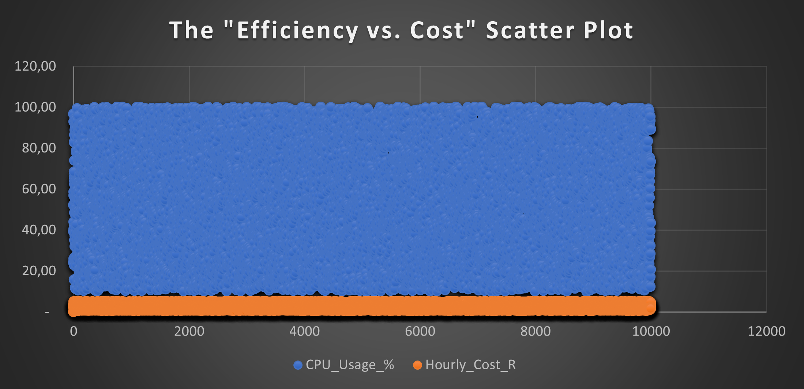

# ☁️ Lumina AI  
## Cloud Economics, FinOps & Capital Efficiency Intelligence Platform

**Lumina AI** is an executive-grade FinOps and cloud economics audit platform designed to identify infrastructure waste, quantify financial leakage, and support CFO / CTO capital allocation decisions.

The system transforms raw cloud usage telemetry into **decision-ready financial intelligence**, enabling leadership to treat cloud spend as a **controllable financial asset**, not a fixed IT cost.

---

## 🧠 Executive Summary

Large-scale cloud environments often hide material inefficiencies behind technical metrics that lack financial context.  
Lumina AI bridges this gap by translating infrastructure utilization into **capital efficiency, cost recovery potential, and executive action signals**.

This platform analyzes **10,000+ compute nodes across multiple regions**, applies deterministic financial thresholds, and surfaces **immediate cost optimization opportunities** in ZAR terms.

---

## 🎯 Business Problem

Organizations operating at scale face persistent challenges in cloud cost governance:

- Idle or underutilized instances consuming capital
- Limited finance-grade visibility into cloud economics
- Weak linkage between technical utilization and financial outcomes
- Manual, error-prone cost review processes

As a result, material cloud waste often goes **undetected until it becomes financially significant**.

---

## 💡 Solution Overview

Lumina AI applies **financial logic, efficiency thresholds, and regional benchmarking** directly to infrastructure data to surface actionable insights.

### Core Capabilities
- Infrastructure efficiency classification
- Regional cloud cost benchmarking
- Quantification of waste in **ZAR**
- Executive-ready dashboards
- Action-oriented shutdown and optimization recommendations

---

## 📊 Executive Dashboards

### Executive Financial Overview
**Board-level view** of cost concentration, waste exposure, and regional spend risk.

---

### Technical Audit & Raw Infrastructure Logs
**Node-level diagnostics** linking CPU utilization, instance cost, and efficiency classification.

---

## ⚙️ Audit Logic & Classification Framework

Each infrastructure node is evaluated using deterministic financial rules that translate utilization into capital impact.

### Efficiency Rules
- **CPU Utilization < 5%** + High Hourly Cost  
  → **CRITICAL: SHUTDOWN**
- Moderate utilization  
  → **MAINTAIN**
- Efficient utilization  
  → **OPTIMAL**

### Status Categories
- `OPTIMAL` – Efficient capital deployment  
- `MAINTAIN` – Acceptable performance, monitor  
- `CRITICAL: SHUTDOWN` – Immediate financial leakage identified  

---

## 🌍 Regional Cost Benchmarking

The platform benchmarks cloud economics across:
- **London**
- **Cape Town**
- **New York**

This enables:
- Identification of regional inefficiencies
- Cross-region cost comparison
- Informed workload relocation decisions

---

## 💰 Financial Impact (ZAR)

| Metric | Value |
|------|------|
| Hourly Waste Identified | **R12,416.52** |
| Monthly Savings Opportunity | **~R8.9 Million** |
| Annual Capital Recovery Potential | **~R107 Million** |

> These results demonstrate how small utilization inefficiencies scale into **material financial risk** at enterprise level.

---

## 🛠️ Technology & Methodology

### Technical Stack
- **Excel (Power Pivot)** – Financial modeling & analytics engine  
- **Deterministic Financial Logic** – Cost-efficiency thresholds  
- **Executive Dashboards** – CFO / CTO decision views  
- **ZAR-Localized Modeling** – Finance-led cloud economics  

### Framework Alignment
- **FinOps Lifecycle:** Inform → Optimize → Operate  
- **Finance Transformation & CFO-Office Analytics**

---

## 📁 Repository Contents

- `Lumina_AI_Dashboard.xlsx` — Core FinOps analytics engine  
- `Lumina_Main_Dashboard.png` — Executive dashboard view  
- `Lumina_Raw_Logs.png` — Technical audit & utilization evidence  
- `README.md` — Executive case study documentation  

---

## 👨‍💻 Recruiter Note

This project demonstrates the ability to:
- Translate technical infrastructure data into **financial decision signals**
- Quantify cloud waste in **capital terms**
- Design executive-grade analytics for **CFO, Strategy, and FinOps leadership**

Directly applicable to roles in:
**FinOps • Finance Transformation • Strategy • Cloud Economics • CFO Office**

